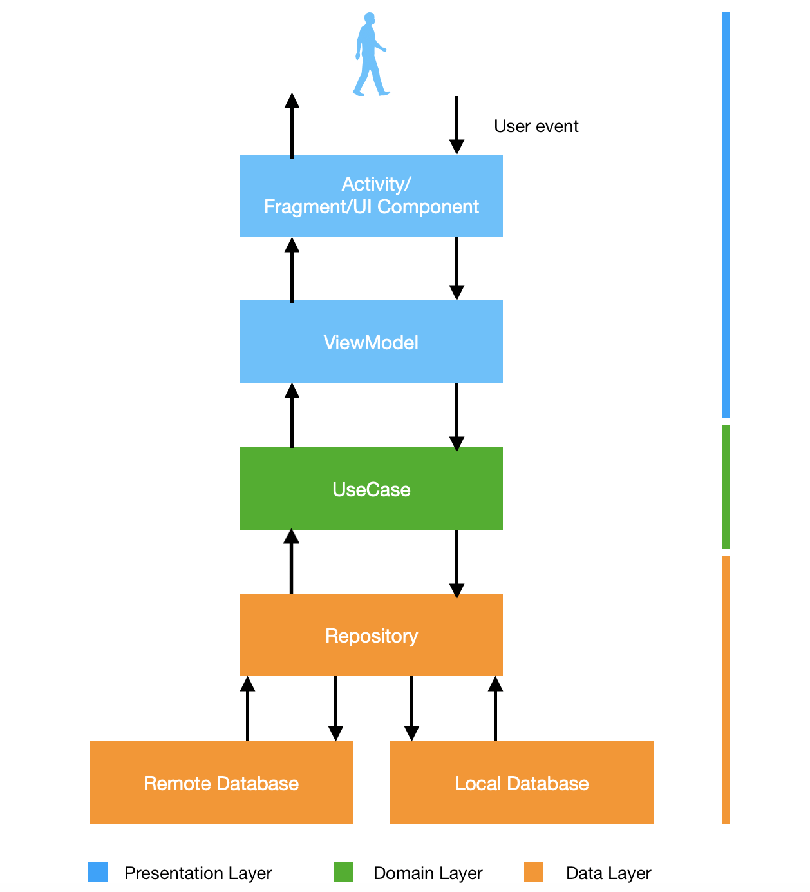
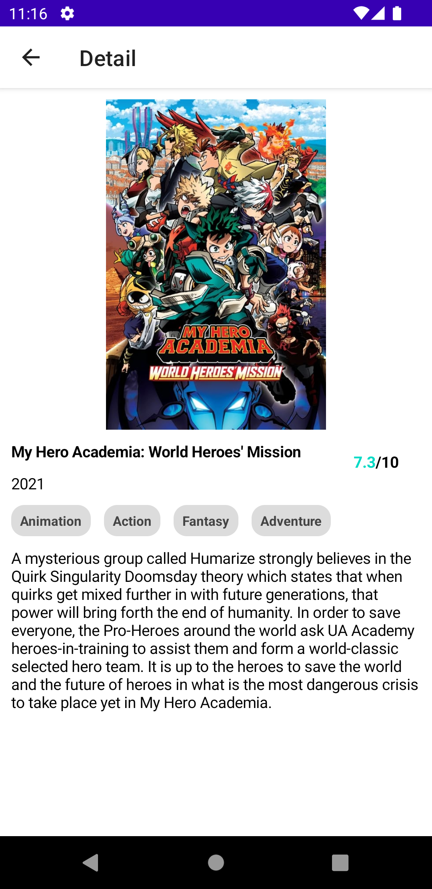

# Movies App

An Android app consuming MovieDb API to display list of movies, built with Compose, MVVM pattern as
well as Architecture Components.

Min Api Level: 21

Build System : [Gradle](https://gradle.org/)

## Table of Contents

- [Prerequisite](#prerequisite)
- [App](#app)
- [Architecture](#architecture)
- [Testing](#testing)
- [Libraries](#libraries)
- [Screenshots](#screenshots)

## Prerequisite

This project uses the Gradle build system. To build this project, use the
`gradlew build` command or use "Import Project" in Android Studio.

## App

The app loads the the movies from the api and displays them in a list. When the Movie is clicked the
app navigates to the Details Screen which shows more details.

## Architecture

The app is built using the Modular MVVM architectural pattern and makes heavy use of a couple of
Android Jetpack components. MVVM allows for the separation of concern which also makes testing
easier. The app has composable screen that communicates to ViewModel which in turn communicates to
the usecase which communicates with Repository to get data.

||
|:----:|

## Testing

The Data tests are located in the unit tests folder on the data module. To run the tests,
run `./gradlew data:test`, results will be posted on `data/build/test-results`

## Libraries

Libraries used in the whole application are:

- [Jetpack](https://developer.android.com/jetpack)🚀
    - [Viewmodel](https://developer.android.com/topic/libraries/architecture/viewmodel) - Manage UI
      related data in a lifecycle conscious way
    - [Compose](https://developer.android.com/courses/pathways/compose) - A modern declarative way
      to build android ui
    - [Paging 3](https://developer.android.com/topic/libraries/architecture/paging/v3-overview) used
      for paging
- [Retrofit](https://square.github.io/retrofit/) - Type-safe HTTP client and supports coroutines out
  of the box. Used for the network calls.
- [Gson](https://github.com/google/gson) - Used to convert JSON to Java/Kotlin classes for the
  Retrofit
- [okhttp-logging-interceptor](https://github.com/square/okhttp/blob/master/okhttp-logging-interceptor/README.md)
    - logs HTTP request and response data.
- [kotlinx.coroutines](https://github.com/Kotlin/kotlinx.coroutines) - Library Support for
  coroutines
- [Hilt](https://developer.android.com/training/dependency-injection/hilt-android) - Used for
  Dependency injection
- [Coil](https://coil-kt.github.io/coil/compose/) - Allows for fetching and displaying of images in
  the composables

## Screenshots

|||
|:----:|:----:|

|||
|:----:|:----:|